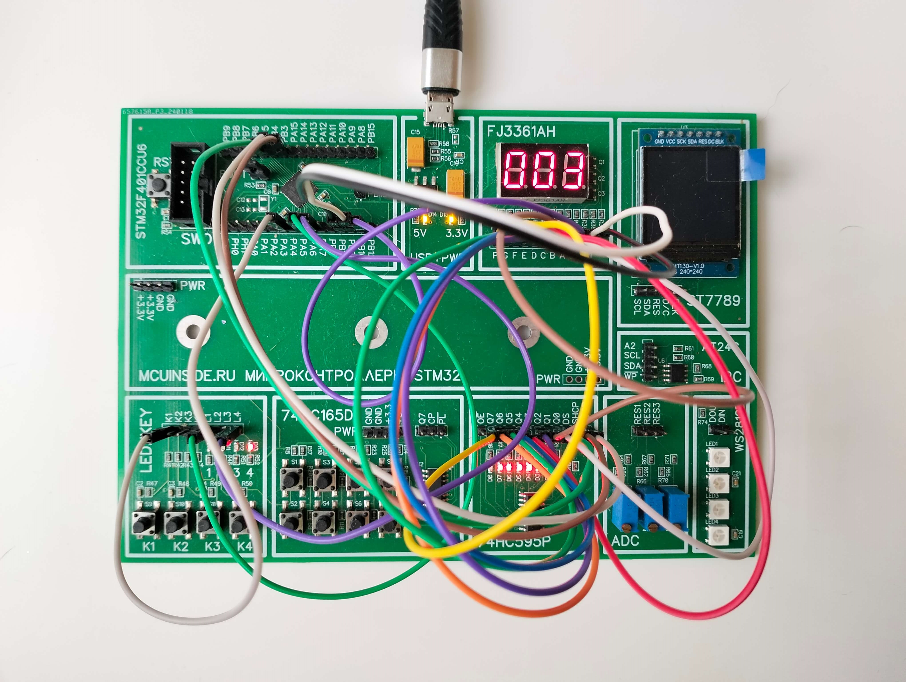

# STM32 Button SPI Counter

**Choose your language / Выберите язык :**

*   [English](README.md)
*   [Русский](README.ru.md)

[](https://opensource.org/licenses/MIT)
[](https://www.st.com/en/development-tools/stm32cubeide.html)
[](https://www.st.com/en/microcontrollers-microprocessors/stm32f4-series.html)

Проект для микроконтроллера STM32, реализующий счётчик нажатий кнопки с выводом значения на трёхразрядный семисегментный индикатор с помощью SPI и динамической индикации.



[Демонстрация работы](Docs/btn_counter.mp4)

## 📋 Оглавление

- [О проекте](#-о-проекте)
- [Используемая периферия и технологии](#-используемая-периферия-и-технологии)
- [Схема подключения](#-схема-подключения)
- [Сборка и запуск](#-сборка-и-запуск)
- [Структура проекта](#-структура-проекта)
- [Автор](#-автор)
- [Лицензия](#-лицензия)

## 🚀 О проекте

Данный проект демонстрирует работу с:
*   **Внешними прерываниями (EXTI)** для обработки нажатий кнопки.
*   **Интерфейсом SPI** для управления сдвиговым регистром 74HC595.
*   **Динамической индикацией** для вывода числа на трёхразрядный индикатор.
*   **Драйвером HAL** от STMicroelectronics.

При каждом нажатии кнопки значение счётчика увеличивается (от 0 до 999, затем сбрасывается). Текущее значение отображается на индикаторе.

## 🛠 Используемая периферия и технологии

*   **Микроконтроллер:** STM32F401CCU6 (но может работать и на других сериях) в составе набора конструктора [MCUINSIDE v 1.0] (https://electronics-krd.ru/magazin/product/stmf401)
*   **Периферия МК (на плате набора, но можно подключить на макетной плате):**
    *   GPIO (Кнопка, LED, управление разрядами индикатора)
    *   EXTI (Внешнее прерывание по кнопке)
    *   SPI (Передача данных на индикатор)
*   **Внешние компоненты (на плате набора, но можно подключить на макетной плате):**
    *   Кнопка
    *   Светодиод (индикация нажатия)
    *   Трёхразрядный семисегментный индикатор и сдвиговый регистр .
*   **Среда разработки:** STM32CubeIDE
*   **Фреймворк:** STM32CubeF4 HAL
*   **Язык:** C

## 🔌 Схема подключения

<!-- Опишите или прикрепите изображение схемы. Это КРИТИЧЕСКИ важный раздел! -->

| Компонент | Контакт STM32 |Контакт 74HC595P | Контакт FJ3361H |
| :--- | :--- | :--- | :--- |
| Кнопка | PA3 (EXTI3) | - | - |
| Светодиод (LED) | PA5 | - | - |
| SPI3_SCK | PB3 | SHCP | - |
| SPI3_MOSI | PB5 | DS | - |
| Chip Select (SC) | PB4 | STCP | - |
| Разряд "Единицы" | PB10 | - | 3 |
| Разряд "Десятки" | PB2 | - | 2 |
| Разряд "Сотни" | PB1 | - | 1 |
| | | Q0 | A |
| | | Q1 | B |
| | | Q2 | C |
| | | Q3 | D |
| | | Q4 | E |
| | | Q5 | F |
| | | Q6 | G |
| | | Q7 | P |


## 🛠 Сборка и запуск

1.  **Клонирование репозитория**
    ```bash
    git clone https://github.com/FSHE-IIoT/stm32-button-spi-7seg.git
    cd stm32-button-spi-7seg
    ```

2.  **Открытие проекта**
    *   Запустите STM32CubeIDE.
    *   Выберите `File -> Import -> General -> Existing Projects into Workspace`.
    *   Укажите путь к папке проекта. Проект должен появиться в списке.

3.  **Сборка проекта**
    *   В IDE откройте файл button_counter.ioc.
    *   В панеле инструментов нажмите на значок `Device Configuration Tool Code Generation`.
    *   Нажмите на значок молотка (`Build` или `Ctrl+B`).

4.  **Прошивка МК**
    *   Подключите отладочную плату (например, ST-Link) к компьютеру и МК.
    *   Нажмите на значок "жучка" (`Debug` или `F11`). Среда сама соберёт проект (если надо) и прошьёт его.

5.  **Запуск**
    *   После прошивки программа запустится. Нажимайте на кнопку и наблюдайте за изменением числа на индикаторе.

## 📁 Структура проекта
    
    stm32-button-spi-7seg/
    │
    ├── Core/
    │   ├── Inc/
    │   │   ├── main.h              // Главный заголовочный файл, сгенерированный CubeMX
    │   │   ├── stm32f4xx_hal_conf.h // Конфигурация HAL
    │   │   └── btn_counter.h       // Пользовательский заголовок: API для работы с кнопкой, счетчиком и дисплеем
    │   │
    │   └── Src/
    │       ├── main.c              // Главный файл: инициализация, основной цикл, обработка прерываний
    │       ├── stm32f4xx_it.c      // Файл обработчиков прерываний (содержит EXTI3_IRQHandler)
    │       ├── stm32f4xx_hal_msp.c // HAL-овская инициализация периферии
    │       └── btn_counter.c       // Реализация всей логики счетчика, дисплея и передачи по SPI
    │
    ├── Drivers/                    // Библиотеки STM32CubeF4 (добавляются автоматически средой)
    ├── STM32F401CCUx_FLASH.ld     // Скрипт линковки
    └── button_counter.ioc         // Файл конфигурации CubeMX
    
### Ключевые модули и их взаимодействие:

1.  **`main.c:`**

    *   Выполняет инициализацию HAL, системного тактирования и периферии (через `MX_*_Init()`).
    *   Инициализирует пользовательские модули, вызывая функции из `btn_counter.c`.
    *   В бесконечном цикле (`while (1)`) постоянно обновляет дисплей, получая актуальное значение счетчика.

2.  **`btn_counter.h` / `btn_counter.c`:**

    *   **Cердце проекта.** Содержит всю пользовательскую логику.
    *   `Display_InitTypeDef`: Структура для настройки пинов управления разрядами дисплея.
    *   `led_init()`, `btn_init()`, `transmit_init()`, `display_init()`: Функции инициализации.
    *   `get_counter()`: Функция для получения текущего значения счётчика.
    *   `update_display()`: Функция для динамической индикации (мультиплексирования).
    *   `HAL_GPIO_EXTI_Callback()`: **Обработчик прерывания по кнопке**. Инкрементирует счётчик и переключает светодиод.

3.  **`stm32fxx_it.c:`(автоматически генерируется при компиляции проекта)**

    *   Содержит вектор прерываний. Прерывание от кнопки (PA3 -> EXTI3) обрабатывается здесь в функции `EXTI3_IRQHandler()`, которая, в свою очередь, вызывает HAL-овский механизм и приводит к выполнению `HAL_GPIO_EXTI_Callback()` в `btn_counter.c`.

4.  **`button_counter.ioc`:**

    *   Визуальная конфигурация пинов и периферии в STM32CubeMX. Здесь настроены:
        *   SPI3 в режиме Master.
        *   Пины PA5 (LED) и PB4 (Chip Select) как GPIO Output.
        *   Пин PA3 (Кнопка) как GPIO External Interrupt.
        *   Пины PB1, PB2, PB10 (Разряды дисплея) как GPIO Output.

## 👨💻 Автор

**Oleg Dobrovolsky**  

FSHE IIoT - Full Stack Hardware Engineer, Industrial Internet of Things

## 📄 Лицензия

Этот проект распространяется под лицензией MIT. Подробнее см. [LICENSE](https://opensource.org/licenses/MIT)
